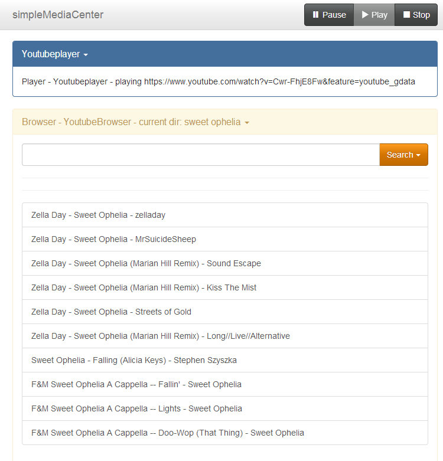
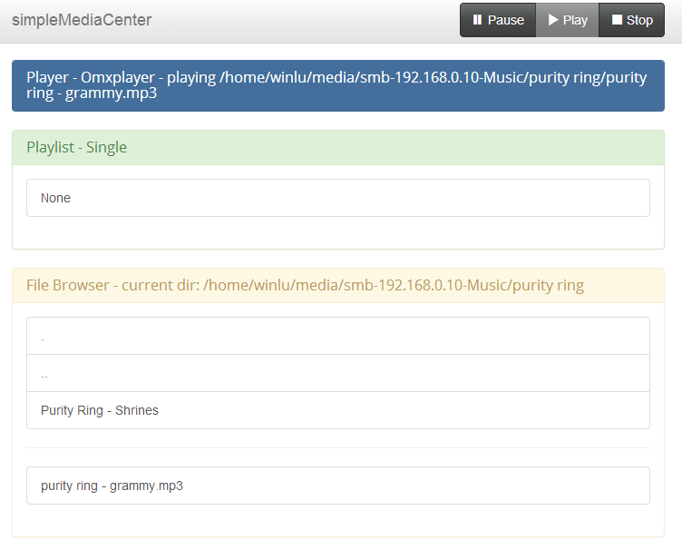

simpleMediaCenter
=================

simpleMediaCenter aims to provide an easy on ressources way to use your computer as an Media Center. It is primarily designed to act as an alternative to XBMC on the rpi. 

Planned Core Features:
+ Web Interface (jinja + turbogears)
+ omxplayer compatibility

##TO-DO and IDEAS
priority from top to bottom:
+ ~~implement an interface where js or other clients can pull json data from~~
+ ~~use javascript to disable buttons~~
+ ~~move player to the navbar~~
+ ~~split up index page generation from playerstatus~~
+ ~~implement automatic player choosing~~
+ ~~rework Browser~~
   + ~~should use id's to interact with controller, not the actual value, no idea what I was thinking~~
   + ~~couple them with player, i.e. don't let any player use any browser~~
   + implement pagination
   + ~~implement sendToBrowser in REST Interface~~
   + complete TwitchBrowser
   + complete YoutubeBrowser
+ exceptions
   + create exceptionclasses for input/processing errors
   + ~~create space in templates to display exceptiontext~~
   + ~~implement javascript to display exceptions~~
+ ~~implement configparser~~
+ implement playlist functionality
+ improve documentation 5%
+ improve comments in code 5%
+ rework omxplayer to use dbus interface
+ feedback for longer loads
   + convince artist to paint a loading please wait image in exchange for beer
   + implement 'holding' page while load
+ add webinterface to change settings
+ drag and drop between browser/playlist

##Requirements
+ python3
+ [omxplayer](http://omxplayer.sconde.net/)
+ [TurboGears2](http://turbogears.org/)
+ [jinja2](http://jinja.pocoo.org/)
+ [youtube-dl](https://github.com/rg3/youtube-dl)
    for youtube playback
+ [Bootswatch (Bootstrap-Themes)](https://github.com/thomaspark/bootswatch) (included)

##Installation and Configuration
1. install python3
2. install youtube-dl
3. install omxplayer
4. install Turbogears2 and jinja2 via python-pip
5. clone this repository (on release there will be a package on pypi)
6. navigate to the simpleMediaCenter/simpleMediaCenter directory
7. run simpleMediaCenter.py
8. after the first launch a config file will be generated at ~/.simpleMediaCenter-config.ini which can be edited to customize behaviour

Please note that this project is still in heavy development and way of installation/configuration will improve

##Screenshot

 
