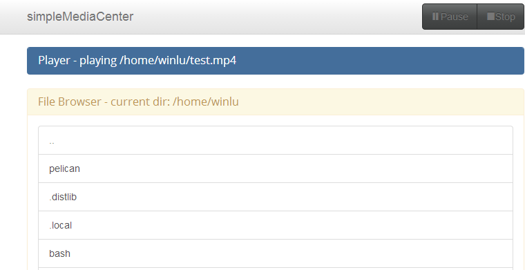

simpleMediaCenter
=================

simpleMediaCenter aims to provide an easy on Ressources way to use your computer as an Media Center. 

Planned Core Features:
+ Web Interface (jinja + turbogears)
+ omxplayer compability

##TODO
+ implement an interface where js or other clients can pull json data from
+ use javascript to disable buttons and display status/warning texts instead of jinja site generation for everything
+ ~~move player to the navbar~~
+ implement playlist functionality
+ implement multithreading

##Requirements
+ omxplayer
+ TurboGears2
+ jinja2
+ [Bootswatch (Bootstrap-Themes)](https://github.com/thomaspark/bootswatch)
+ more?

##Screenshot

 
