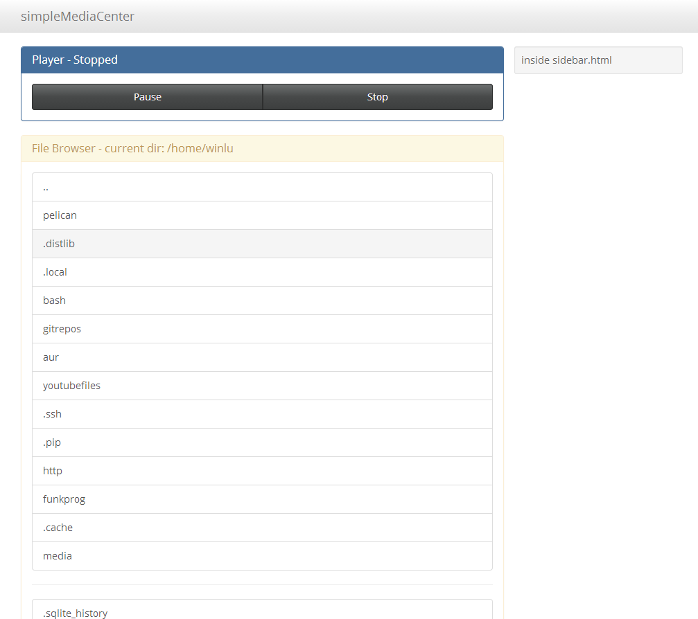

simpleMediaCenter
=================

simpleMediaCenter aims to provide an easy on Ressources way to use your computer as an Media Center. 

Planned Core Features:
+ Web Interface (jinja + turbogears)
+ omxplayer compability

##Requirements
+ omxplayer
+ TurboGears2
+ jinja2
+ more?

##Screenshot

 
